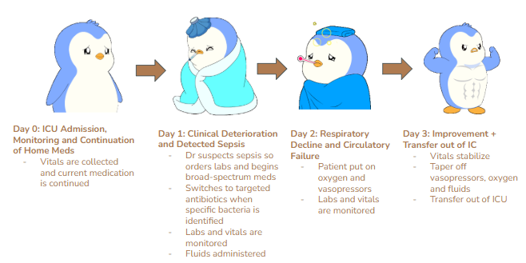

# Bayesian Modeling of Sepsis Progression in ICU Patients using MIMIC-IV Data and Bayesian Modeling

## Introduction [1][2][3]
Sepsis is the body's extreme response to an infection. It is a life-threatening medical emergency since the infection can cause a chain-reaction leading to tissue damage, organ failure and death.
Treatment includes antibiotics, IV fluids, vasopressor, supportive care or surgery if it is extreme.

The Three Stages of Sepsis:

0) SIRS
1) Sepsis
2) Severe Sepsis
3) Septic Shock

Sepsis patients do not follow a linear path and fluctuate between somewhat hidden states (SIRS → Sepsis → Severe Sepsis → Septic Shock → Recovery/Death)

Sepsis is also the leading cause of death in hospital Intensive Care Units (ICUs) and sepsis related hospitalizations increased by 40% from 2016–2021, totaling 2.5 million inpatient stays in 2021. Annual hospital costs reached $52.1 billion in 2021 (14% of all US hospital costs), over half of sepsis hospitalizations were for adults 65 years and older, and one in six older patients with sepsis died in the hospital in 2021.

## Clinical Progression of Sepsis Example
Diagram created by the authors using Google Slides icons and shapes.

Patients typically progress through stages including early infection, systemic inflammatory response syndrome (SIRS), sepsis, and septic shock. Our models aim to infer these latent stages from observed clinical measurements.
## The Critical Need For Sepsis Modeling (Probelm Statement)
Timing is key with sepsis treatment; every hour that passes without treatment significantly increases the risk of permanent organ damage or death. Modeling Sepsis progression will allow for more accurate and faster diagnoses, and will help busy ICUs staff stay one step ahead (proactive treatment instead of reactive treatment). This project models sepsis progression using Bayesian approaches to infer latent clinical states.

## Features
- Feature 1
- Feature 2
- Feature 3

## How It Works

### Model A: 

Uses the following vitals and interventions to predict Sepsis states:
Heart Rate (HR)
Peripheral capillary oxygen saturation (SpO2)
White Blood Cell Count (WBC)
Lactate Levels (Lactate)
Man Arterial Pressure (MAP)
Oxygen
Antibiotics
Cultures
Vasopressors

#### model_1.py
Set initial transition probability matrix, emission means matrix, and hidden state starting probabilities (all based on researched metrics). 

Use hmmlearn (4 state Gaussian Hidden Markov Model). 

#### train_model_1.py

Train the model. Use Hmmlearn

#### evaluation.py
Generate missing flags for vitals. Mask if missing after two hours.
Use lactate levels to assign hidden sepsis states. We generate an alert whenever the probability of progressing to the next stage is above 30%.

Code exists to evaluate model (print out learned transition and emission matrices) and to generate useful charts for individual patients.

## Installation
git clone https://github.com/username/sepsis-progression-model
cd sepsis-progression-model
pip install -r requirements.txt
python src/train_model_1.py

## Usage
Example commands or screenshots.

## Results
What results you got.

## Future Improvements
Possible next steps

### Collaborators
Ryan Abdelrahim, Collin Kim, Yuta Kobayashi, Junghoon Yum and Nick Thompson

### References
[1] https://www.cdc.gov/sepsis/about/index.html#:~:text=Sepsis%20is%20a%20life%2Dthreatening%20medical%20emergency%20that,infections%2C%20such%20as%20influenza%20*%20Fungal%20infections
[2] https://my.clevelandclinic.org/health/diseases/12361-sepsis
[3] https://www.salvilaw.com/blog/sepsis-stages/
